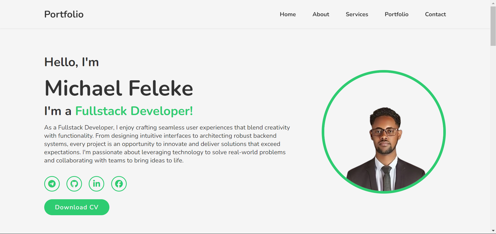
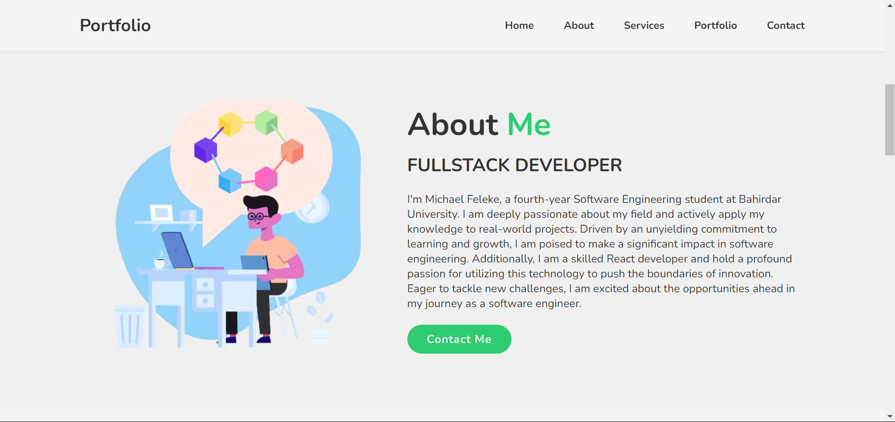
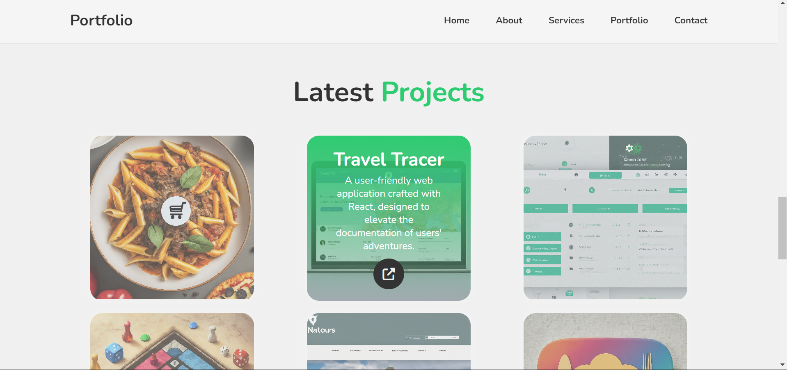
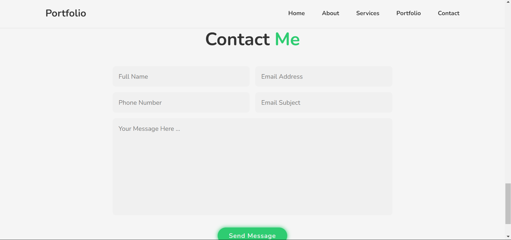

<h1 align="center">Home page</h1>

<h1 align="center">About page</h1>

<h1 align="center">Latest Projects</h1>

<h1 align="center">Contact me</h1>

<h1>Key Features: </h1>

Home Page:
- 🏠 Engaging Landing: Welcome visitors with an engaging and visually appealing landing page that showcases your unique style and creativity.
- 🌟 Portfolio Highlights: Highlight your best work directly on the home page, giving visitors a glimpse of your skills and expertise.
- 📱 Responsive Design: Ensure a responsive design that looks great on all devices, providing a seamless browsing experience for every visitor.
  
About Page:
- 🧑‍💼 Personal Introduction: Introduce yourself and your journey in the industry, connecting with visitors on a personal level.
- 🛠️ Skills & Expertise: Showcase your skills, expertise, and areas of specialization, giving visitors a clear understanding of what you bring to the table.
- 🎓 Education & Experience: Share your educational background, professional experience, and any notable achievements to build credibility.
  
My Services Page:
- 💼 Services Offered: Outline the services you offer, such as web design, graphic design, content creation, etc., with detailed descriptions for each service.
- 🌐 Custom Solutions: Emphasize your ability to provide tailored solutions based on client needs, showcasing your flexibility and problem-solving skills.
- 🚀 Benefits to Clients: Highlight the benefits clients can expect by choosing your services, such as quality deliverables, timely completion, and excellent customer support.
  
Latest Projects Page:
- 🌟 Showcase Projects: Display your latest projects with high-quality visuals, descriptions, and technologies used, demonstrating your skills and creativity.
- 📊 Project Success Stories: Share success stories or client testimonials related to your projects, showcasing your ability to deliver outstanding results.
- 🔄 Continuous Updates: Regularly update this page with new projects to keep visitors informed about your recent work and ongoing development.
  
Contact Me Page:
- 📞 Contact Information: Provide multiple contact options such as email, phone, and social media links, making it easy for visitors to reach out to you.
- 📝 Inquiry Form: Include a contact form where visitors can send inquiries or project requests directly from your website, streamlining communication.
- 🕒 Prompt Response: Assure visitors of a prompt response to their inquiries, showcasing your professionalism and dedication to client communication. 
